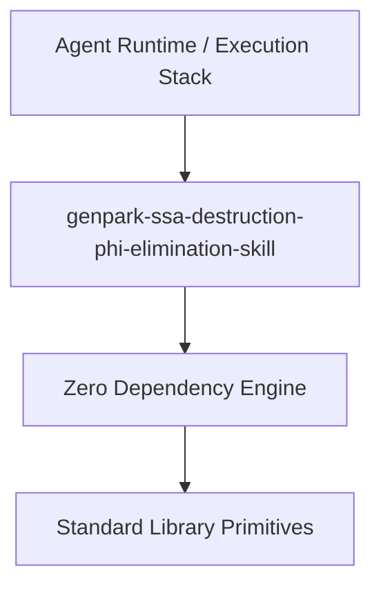

# genpark-ssa-destruction-phi-elimination-skill

[](https://github.com/alphaparkinc/genpark-ssa-destruction-phi-elimination-skill)
[](https://github.com/alphaparkinc/genpark-ssa-destruction-phi-elimination-skill)
[](https://www.python.org/)

Out-of-SSA / SSA destruction engine replacing phi-functions with parallel copy sequences across control flow merge edges.



## Features
- **Strict 0 Pip Dependencies**: Built completely using the Python Standard Library.
- **Fast Execution & Verification**: Includes client wrapper, MCP server, and verified test suites.
- **Agentic AI Ready**: Exposes standard MCP tools for continuous LLM integration.

## Installation & Quickstart
```bash
git clone https://github.com/alphaparkinc/genpark-ssa-destruction-phi-elimination-skill.git
cd genpark-ssa-destruction-phi-elimination-skill
python example_usage.py
```
